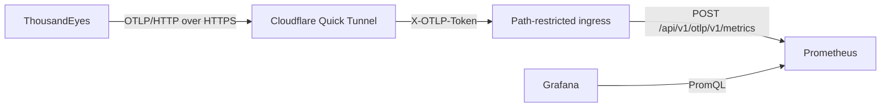

# Stream ThousandEyes Endpoint Connection metrics to Grafana

This repository is a local, Docker-based lab for streaming ThousandEyes OpenTelemetry metrics directly into Prometheus and visualizing Endpoint Experience Local Network `Connection` data in Grafana.



The stack includes:

- Prometheus with its native OTLP/HTTP receiver enabled
- Promotion of every OpenTelemetry resource attribute to a Prometheus label
- A small NGINX ingress that exposes only the OTLP metrics path and requires a private header
- A Cloudflare Quick Tunnel that gives the local OTLP receiver a public HTTPS URL
- Grafana with a preconfigured Prometheus data source and an Endpoint Connection dashboard

> [!WARNING]
> Cloudflare Quick Tunnels are intended for testing and development. Their public URL changes when the tunnel is recreated and they have no uptime guarantee. Use an authenticated, named Cloudflare Tunnel or another production ingress for a durable integration.

## Endpoint Connection data

The dashboard focuses on the ThousandEyes [Endpoint Experience Local Network `Connection` category](https://docs.thousandeyes.com/product-documentation/integration-guides/opentelemetry/data-model/data-model-v2/metrics#endpoint-experience-local-network):

| Metric | Meaning | Unit |
| --- | --- | --- |
| `network.signal.quality` | Current connection signal quality | Percentage |
| `network.connection.throughput` | Receive and transmit throughput | Bytes per second |
| `network.connection.link_speed` | Negotiated link speed | Bytes per second |
| `network.wifi.retransmission.rate` | Retransmitted Wi-Fi PHY frames | Percentage |
| `network.wifi.roaming.events.count` | BSSID changes in the collection window | Count |
| `network.wifi.channel.changes.count` | Wi-Fi channel changes in the collection window | Count |
| `network.connection.score` | Overall active-connection score | Score |
| `network.signal.rssi` | Received Signal Strength Indicator | dBm |
| `network.signal.rsrp` | Reference Signal Received Power | dBm |
| `network.signal.rsrq` | Reference Signal Received Quality | dB |
| `network.signal.sinr` | Signal-to-Interference-plus-Noise Ratio | dB |
| `network.signal.rscp` | Received Signal Code Power | dBm |

The `Connection` metrics also carry connection details such as interface, SSID, BSSID, Wi-Fi channel, PHY mode, access-point vendor, cellular generation, carrier, and driver information. The common resource attributes identify the stream, account, Endpoint Agent, location, public and local network, connection type, ASN, data-model version, and permalink.

## Prerequisites

- Docker Engine or Docker Desktop with Docker Compose
- A ThousandEyes account with Endpoint Agents producing Local Network data
- Permission to manage Integrations 1.0, or a ThousandEyes API bearer token with access to the target account group
- At least one Endpoint Agent label that selects the agents whose local-network data should be streamed

## 1. Configure local credentials

Create the local environment file:

```bash
cp .env.example .env
```

Generate a value and put it in `.env` as `OTLP_TOKEN`:

```bash
openssl rand -hex 32
```

Do not commit `.env`. The provided `.gitignore` excludes it.

`OTLP_TOKEN` becomes the value of a custom `X-OTLP-Token` request header. NGINX rejects requests without the matching header and rejects every path except Prometheus's OTLP metrics endpoint.

## 2. Start Prometheus, Grafana, and cloudflared

```bash
docker compose up -d
docker compose ps
```

Local services are available at:

- Prometheus: <http://localhost:9090>
- Grafana: <http://localhost:3000>

Sign in to Grafana with the default username `admin` and password `admin`. Grafana asks you to change the password after the first sign-in. The `ThousandEyes / Endpoint Local Network / Connection` dashboard is provisioned automatically.

Prometheus starts with `--web.enable-otlp-receiver`, which enables OTLP/HTTP metrics ingestion at `/api/v1/otlp/v1/metrics`. Its configuration also allows samples up to 30 minutes out of order, which is useful when batches arrive late.

## 3. Get the public OTLP URL

Wait for `cloudflared` to print its generated URL:

```bash
docker compose logs cloudflared
```

Look for a URL similar to:

```text
https://random-words.trycloudflare.com
```

The exact ThousandEyes destination is the generated URL plus the full Prometheus OTLP metrics path:

```text
https://random-words.trycloudflare.com/api/v1/otlp/v1/metrics
```

Confirm that the public endpoint is reachable and protected. Load the token without printing it:

```bash
OTLP_TOKEN_VALUE=$(sed -n 's/^OTLP_TOKEN=//p' .env)
TUNNEL_URL=https://random-words.trycloudflare.com

curl --silent --show-error --output /dev/null --write-out '%{http_code}\n' \
  --request POST \
  --header 'Content-Type: application/x-protobuf' \
  --header "X-OTLP-Token: ${OTLP_TOKEN_VALUE}" \
  --data-binary '' \
  "${TUNNEL_URL}/api/v1/otlp/v1/metrics"
```

An empty, valid protobuf request should return `200`. Repeating the request without `X-OTLP-Token` should return `401`. A request to any other path should return `404`.

## 4. Create the ThousandEyes stream in the UI

1. In ThousandEyes, go to **Manage > Integrations > Integration 1.0**.
2. Select **New Integration > OpenTelemetry Integration**.
3. Enter a name, for example `Local Prometheus - Endpoint Connection`.
4. Set **Target** to **HTTP**.
5. Set **Endpoint URL** to the full public URL from the previous section, including `/api/v1/otlp/v1/metrics`.
6. Choose custom authentication and add `X-OTLP-Token` with the value from `.env`.
7. Set **OpenTelemetry Signal** to **Metric**.
8. Set **Data Model Version** to **v2**. Dynamic and Local Network Endpoint metrics require v2.
9. In the Endpoint Experience selection, choose one or more Endpoint Agent labels. These labels determine which agents contribute Local Network data.
10. Save the integration, then use **Test** if that option is available.

The integration sends all supported Endpoint Local Network categories for the selected agents. Prometheus and the supplied dashboard focus on the `Connection` metric names.

## 5. API alternative

Set local shell variables. The tunnel value must not end with `/`, and `OTLP_TOKEN_VALUE` must match `.env`:

```bash
export TE_BEARER_TOKEN='replace-with-your-ThousandEyes-token'
export TE_ACCOUNT_GROUP_ID='replace-with-your-account-group-id'
export TUNNEL_URL='https://random-words.trycloudflare.com'
export OTLP_TOKEN_VALUE=$(sed -n 's/^OTLP_TOKEN=//p' .env)
```

List Endpoint Agent labels and choose the ID that covers the desired agents:

```bash
curl --silent --show-error \
  --header "Authorization: Bearer ${TE_BEARER_TOKEN}" \
  "https://api.thousandeyes.com/v7/endpoint/labels?aid=${TE_ACCOUNT_GROUP_ID}" \
  | jq '.labels[] | {id, name}'
```

Create and enable the v2 metric stream:

```bash
export ENDPOINT_AGENT_LABEL_ID='replace-with-label-id'

jq --null-input \
  --arg endpoint "${TUNNEL_URL}/api/v1/otlp/v1/metrics" \
  --arg token "${OTLP_TOKEN_VALUE}" \
  --arg label_id "${ENDPOINT_AGENT_LABEL_ID}" \
  '{
    name: "Local Prometheus - Endpoint Connection",
    type: "opentelemetry",
    signal: "metric",
    endpointType: "http",
    streamEndpointUrl: $endpoint,
    customHeaders: {"X-OTLP-Token": $token},
    dataModelVersion: "v2",
    endpointAgentLabel: [{id: $label_id}],
    enabled: true
  }' \
  | curl --silent --show-error --fail-with-body \
      --request POST \
      --header 'Content-Type: application/json' \
      --header "Authorization: Bearer ${TE_BEARER_TOKEN}" \
      --data-binary @- \
      "https://api.thousandeyes.com/v7/streams?aid=${TE_ACCOUNT_GROUP_ID}" \
  | jq .
```

ThousandEyes treats `endpointAgentLabel` and `endpointAgentTag` as synchronized alternatives. Configure only one of them.

Check delivery status without changing the stream:

```bash
curl --silent --show-error \
  --header "Authorization: Bearer ${TE_BEARER_TOKEN}" \
  "https://api.thousandeyes.com/v7/streams?aid=${TE_ACCOUNT_GROUP_ID}" \
  | jq '.[] | {id, name, enabled, streamStatus}'
```

## 6. Verify data in Prometheus and Grafana

In the Prometheus expression browser, start with:

```promql
count by (__name__) (
  {__name__=~"network_(signal|connection|wifi)_.*", thousandeyes_data_version="v2"}
)
```

The default Prometheus OTLP translation replaces dots with underscores and may append type or unit suffixes. For example, `network.signal.quality` begins with `network_signal_quality` after translation. The dashboard deliberately matches the translated prefixes so it remains valid when a suffix is present.

In Grafana, open **Dashboards > ThousandEyes > Endpoint Local Network - Connection**. Use the Agent, Connection type, and SSID variables to narrow the view.

Resource attributes are available as labels because [prometheus/prometheus.yml](prometheus/prometheus.yml) contains:

```yaml
otlp:
  promote_all_resource_attributes: true
```

Promoting everything is useful for this lab, but attributes such as agent, SSID, BSSID, network, location, and custom ThousandEyes tags can create many time series. For a larger or long-lived environment, monitor cardinality and replace this option with an explicit `promote_resource_attributes` allowlist.

## Troubleshooting

### The stream is `pending`

- Confirm that the selected Endpoint Agent label includes enabled, recently active agents.
- Confirm that those agents are collecting Local Network data.
- Keep the stack and Quick Tunnel running. A stopped laptop cannot receive data.

### The stream is `failing`

- `401` means the `X-OTLP-Token` in ThousandEyes does not match `.env`.
- `404` usually means `/api/v1/otlp/v1/metrics` is missing from the Endpoint URL.
- Recheck `docker compose logs cloudflared`. A recreated Quick Tunnel has a new public URL, so the ThousandEyes integration must be updated.
- Run `docker compose logs otlp-ingress prometheus` to distinguish ingress rejection from Prometheus ingestion errors.

### Grafana has no Connection data

- Run the PromQL verification query above in Prometheus.
- Confirm that the stream uses data model v2.
- Confirm that `thousandeyes_data_version="v2"` exists on the received metrics.
- Widen the Grafana time range. Local Network data can arrive less frequently than Prometheus's own scraped metrics.

## Stop the lab

Stop containers while keeping Prometheus and Grafana data:

```bash
docker compose down
```

To also delete the local Prometheus and Grafana volumes, use `docker compose down --volumes`. That permanently removes the lab's stored metrics and dashboards state.

## References

- [ThousandEyes OpenTelemetry data model v2 metrics](https://docs.thousandeyes.com/product-documentation/integration-guides/opentelemetry/data-model/data-model-v2/metrics)
- [ThousandEyes OpenTelemetry stream API](https://developer.cisco.com/docs/thousandeyes/create-data-stream/)
- [Prometheus OpenTelemetry guide](https://prometheus.io/docs/guides/opentelemetry/)
- [Prometheus OTLP configuration](https://prometheus.io/docs/prometheus/3.5/configuration/configuration/#otlp)
- [Cloudflare Quick Tunnels](https://developers.cloudflare.com/cloudflare-one/networks/connectors/cloudflare-tunnel/do-more-with-tunnels/trycloudflare/)
